<picture>
  <source media="(prefers-color-scheme: dark)" srcset="assets/bento-dark.svg">
  
</picture>

**Développeur fullstack à Nancy**, 4 ans et demi cumulés sur du code de production. Deux domaines où je vais plus loin :

- **IA** : référent IA en entreprise. Deux automatisations recettées : un ticket devient une merge request, et la documentation technique de 4 dépôts se met à jour seule. Un assistant documentaire qui cite ses sources et refuse de répondre hors de son corpus.
- **Santé réglementée** : une application de suivi patient utilisée chaque jour par des médecins et des prestataires de santé à domicile, sur dispositif médical certifié MDR / ISO 13485. Comptes protégés contre l'usurpation par double authentification.
- **Fullstack** : React, Next.js, TypeScript, NestJS, Laravel, GraphQL, PostgreSQL. [So Barbers](https://sobarbers.com) : un salon réel prend ses rendez-vous en ligne, sans double réservation possible.

[LinkedIn](https://www.linkedin.com/in/ayoubtougani)
